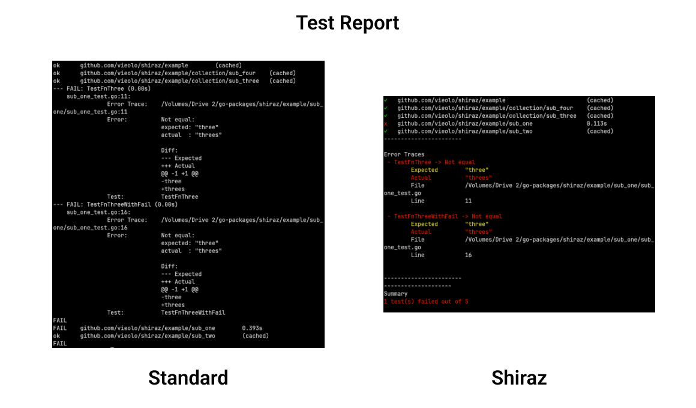

# Shiraz
CLI for testing and coverage of Go projects.

The aim is to provide a better testing and reporting experience compared to the standard testing tools of Golang.




<br>

## Install
Shiraz is a standalone CLI. You can install it globally by running

```bash
go install github.com/vieolo/shiraz@latest
```

After the install, the CLI would be available using `shiraz` command

<br>

## Commands

- `test`: Runs the unit tests of the project. You can provide a test command in the config file (defaults to `go test -v ./...`). The `test` parses the output and you can select the type of output in the config file.
- `report`: Runs the tests and generates a HTML coverage report of your project in the `coverageFolderPath` of the config file. If no path is explicitly provided, the files are generated at `./coverage` folder.

<br>

## shiraz.json
You can define the configuration of your project by creating a `shiraz.json` in your main directory. This file allows you to save your preferences.

All fields in the `shiraz.json` are optional. Here are the possible fields.

- `test`
    - `command`: The test command to be used when calling the `test` cmd. (defaults to `go test -v ./...`)
    - `output`: options are [`pkgname`, `testname`] (defaults to `pkgname`)
- `projectPath`: The path to the go project. Useful if the config file is not in the project being tested.
- `coverageFolderPath`: The path to the folder where the coverage files are generated and saved at
- `env`: The environmental variables to be added when running the test command.
- `ignore`: An array of files of folders you wish to ignore from the report. You need to include the package name as well. e.g. `github.com/example/dir_1` or `github.com/example/dir_2/file_1.go`

<br>
